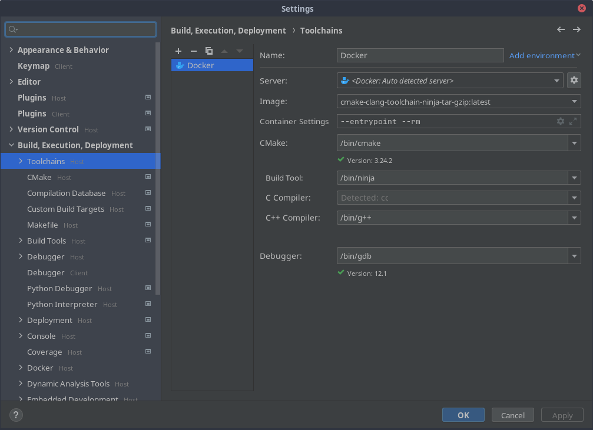

<!--
  Licensed under the Apache License, Version 2.0 (the "License");
  you may not use this file except in compliance with the License.
  You may obtain a copy of the License at

      http://www.apache.org/licenses/LICENSE-2.0

  Unless required by applicable law or agreed to in writing, software
  distributed under the License is distributed on an "AS IS" BASIS,
  WITHOUT WARRANTIES OR CONDITIONS OF ANY KIND, either express or implied.
  See the License for the specific language governing permissions and
  limitations under the License.
-->

The container manifest for this project is found in the [devops](devops)
directory. This project demonstrates use of both [gcc](https://gcc.gnu.org)
and [clang](https://clang.llvm.org), both [ninja](https://ninja-build.org)
and [make](https://www.gnu.org/software/make) in a
[GitHub Actions](https://github.com/features/actions) build matrix. A standard
project would use a single build tool and compiler, though clang also provides
[clang-format](https://clang.llvm.org/docs/ClangFormat.html) and
[clang-tidy](https://clang.llvm.org/extra/clang-tidy).

## Constructing the build environment

### Creating the Guix profile

A reproducible [GNU Guix](https://guix.gnu.org) profile can be created using a
[manifest file](manifest.scm) listing the set of packages to be installed along
with a [channels file](channels.scm) listing the source repository and commit
ID. By passing the `--root=profile` option to
`guix shell`(https://guix.gnu.org/manual/en/html_node/Invoking-guix-shell.html)
a symlink to the profile directory in `/gnu/store` is both created and
registered. This permits introspection of the shell profile, preserves any
newly built packages against garbage collection, and permits instantaneous
reentry into the shell by passing the `--profile=profile` option. By adding the
trailing `[ : ]` no-op command the shell exits after creating the profile.

```console
[user@host devops]$ guix time-machine \
  --channels=channels.scm \
  -- shell \
    --container \
    --root=profile \
    --system=x86_64-linux \
    --no-cwd --share=..=${HOME} \
    --manifest=manifest.scm \
    -- [ : ]
```

### Creating the Docker container

A reproducible [GNU Guix](https://guix.gnu.org) container image can be
similarly created using the manifest and channels files with the
`guix pack`(https://guix.gnu.org/manual/en/html_node/Invoking-guix-pack.html)
command. It is not possible to preserve the container image against garbage
collection, nor to build the container image from a Guix profile.

```console
[user@host devops]$ guix time-machine \
  --channels=channels.scm \
  -- pack \
    --format=docker \
    --compression=zstd \
    --save-provenance \
    --symlink=/bin=bin \
    --symlink=/sbin=sbin \
    --system=x86_64-linux \
    --manifest=manifest.scm

The following derivation will be built:
  /gnu/store/z5hj1kqzs2bpgsx95l5dg8k18i4bi4pb-cmake-clang-toolchain-ninja-tar-gzip-docker-pack.tar.zst.drv

building /gnu/store/z5hj1kqzs2bpgsx95l5dg8k18i4bi4pb-cmake-clang-toolchain-ninja-tar-gzip-docker-pack.tar.zst.drv...
/gnu/store/xvvsbdbgnj3v3d2zns3grb9fl1x1ddg7-cmake-clang-toolchain-ninja-tar-gzip-docker-pack.tar.zst
```

The last output lines from the pack command list the derivation and output
files. The derivation file (with a '.drv' suffix) is a text file describing the
build configuration.

The pack file can be loaded as a [Docker](https://www.docker.com) image.
Typically, the command would be `docker load < [image file]` but in the case
that the compression format is not supported the file must be decompressed and
piped to Docker
([compression formats](https://docs.docker.com/engine/reference/commandline/load)
currently supported are gzip, bzip2, and xz).

```console
[user@host devops]$ zstdcat /gnu/store/xvvsbdbgnj3v3d2zns3grb9fl1x1ddg7-cmake-clang-toolchain-ninja-tar-gzip-docker-pack.tar.zst | docker load
9353b35b51af: Loading layer [==================================================>]  2.925GB/2.925GB
Loaded image: cmake-clang-toolchain-ninja-tar-gzip:latest
```

After loading the image the pack file can optionally be manually deleted.

```console
[user@host devops]$ guix gc -D /gnu/store/*-docker-pack.tar.zst
finding garbage collector roots...
[0 MiB] deleting '/gnu/store/xvvsbdbgnj3v3d2zns3grb9fl1x1ddg7-cmake-clang-toolchain-ninja-tar-gzip-docker-pack.tar.zst'
deleting `/gnu/store/trash'
deleting unused links...
note: currently hard linking saves [...] MiB
```

## Building the project

### Building from the Guix shell

Once saved, the Guix shell can be quickly reconstructed and used to configure,
build, run, test, and debug the project. The compiler can be changed to
`clang++` by switching the toolchain file to `toolchain/clang` and the build
tool can be switched to `make` by dropping the `-G Ninja` option. Also, `lldb`
can be run as the debugger from the command-line.

```console
[user@host devops]$ guix shell \
  --container \
  --profile=profile \
  --no-cwd --share=..=${HOME}

user@host ~ [env]$ cmake -B build -S . -G Ninja -DCMAKE_TOOLCHAIN_FILE=toolchain/gcc -DCMAKE_BUILD_TYPE=RelWithDebInfo
-- The CXX compiler identification is GNU 11.3.0
-- Detecting CXX compiler ABI info
-- Detecting CXX compiler ABI info - done
-- Check for working CXX compiler: /gnu/store/hc2ggs5g6fmjsj5m1nbqvh9w4f9v7ky2-profile/bin/g++ - skipped
-- Detecting CXX compile features
-- Detecting CXX compile features - done
-- Configuring done
-- Generating done
-- Build files have been written to: /home/ec2-user/build

user@host ~ [env]$ cmake --build build
[1/2] Building CXX object source/CMakeFiles/hello.dir/main.cpp.o
[2/2] Linking CXX executable source/hello

user@host ~ [env]$ ./build/source/hello
Hello, World!

user@host ~ [env]$ ctest --test-dir build
Internal ctest changing into directory: /home/ec2-user/build
Test project /home/ec2-user/build
    Start 1: hello
1/1 Test #1: hello ............................   Passed    0.01 sec

100% tests passed, 0 tests failed out of 1

Total Test time (real) =   0.05 sec

user@host ~ [env]$ gdb -q ./build/source/hello
Reading symbols from ./build/source/hello...
(gdb) run
Starting program: /home/ec2-user/build/source/hello 
Hello, World!
[Inferior 1 (process 51) exited normally]
(gdb) quit
```

### Building in a Docker container

The container can be run from the command-line with a
[bind mount](https://docs.docker.com/storage/bind-mounts) to the project
directory.

```console
[user@host devops]$ docker run -it --rm \
  --mount "type=bind,source=${PWD}/..,target=/proj" \
  "cmake-clang-toolchain-ninja-tar-gzip" \
  bash

bash-5.1# cd proj
bash-5.1# cmake [...]
```

The configure, build, run, test, and debug commands and alternative programs
are the same as in the Guix shell.

### Building the project in [JetBrains Clion](https://www.jetbrains.com/clion/)

After building and loading the Docker image, CLion can then be configured to
configure, build, run, test, and debug the project in a Docker container. From
the menu select `File → Settings → Build, Execution, Deployment → Toolchains`.



As in the Guix shell and Docker container, `clang++` can be alternatively
configured for the compiler, `lldb` for the debugger, and `make` for the build
tool.

## Examining the profile

### List requested package

A listing of the packages installed in the profile. This only includes packages
directly installed from the manifest, but is helpful to enumerate the
development dependencies of the project package.

```console
[user@host devops]$ guix package --profile=profile --list-installed | sort
```

<details>
<summary>package list</summary>

bash-minimal       	5.1.8   	out   	/gnu/store/2ysb1fqc7hng95fghqpiynxqk9b6y1pk-bash-minimal-5.1.8
binutils           	2.37    	out   	/gnu/store/rc781v4k0drhaqn90xfwwpspki5x0bvf-binutils-2.37
bzip2              	1.0.8   	out   	/gnu/store/1dsmf5lnyxhp7rsscq95fzjw4blcx1rx-bzip2-1.0.8
clang-toolchain    	15.0.5  	out   	/gnu/store/yp1qdymn9i79rvwyxk6ksj6ykpxbsak0-clang-toolchain-15.0.5
cmake              	3.24.2  	out   	/gnu/store/qv13zgbmyx0vjav8iiqp772kp6rxvwnd-cmake-3.24.2
coreutils          	8.32    	out   	/gnu/store/7scna78ki5n2xdscwvfw32nbzw7b9bln-coreutils-8.32
custom-utf8-locales	2.33    	out   	/gnu/store/s01iby15ikmm8p88nq5wqbns1m2wd372-custom-utf8-locales-2.33
diffutils          	3.8     	out   	/gnu/store/x8dfnsd7phxmjnrlvzxqj1blivw3kb94-diffutils-3.8
file               	5.39    	out   	/gnu/store/vdhd85ahwv8s6hvg5zy7r9i169w28bmq-file-5.39
findutils          	4.8.0   	out   	/gnu/store/qpcx2gc5wx63in9r7hls3k9wcvy40af2-findutils-4.8.0
gawk               	5.1.0   	out   	/gnu/store/q0lfrbqy9pkar254lkamp7hbdykji4dm-gawk-5.1.0
gcc                	11.3.0  	out   	/gnu/store/l07g7xmbyv9x9n44sw1091bjk86vqfbr-gcc-11.3.0
gdb                	12.1    	out   	/gnu/store/pzq7azgjzyk3ns0dxn63jb392ifjzsz2-gdb-12.1
git                	2.38.1  	out   	/gnu/store/h7bnbhkfsdcjsyd3g24www00z4w9a4vh-git-2.38.1
glibc              	2.33    	out   	/gnu/store/5h2w4qi9hk1qzzgi1w83220ydslinr4s-glibc-2.33
glibc              	2.33    	static	/gnu/store/4jdghmc65q7i7ib89zmvq66l0ghf7jc4-glibc-2.33-static
glibc-utf8-locales 	2.33    	out   	/gnu/store/y757kw8rmx5hymn32wjp4ys48f2glbri-glibc-utf8-locales-2.33
grep               	3.6     	out   	/gnu/store/3wsz4i2n63kbmzdy6g04x93k8a5xk0df-grep-3.6
gzip               	1.10    	out   	/gnu/store/mcv66x72crr1rszisiswdr5sbwzxl7d5-gzip-1.10
ld-wrapper         	0       	out   	/gnu/store/1l5ppmc1hbz7vj9ygj8fp4mcibcmyxck-ld-wrapper-0
less               	590     	out   	/gnu/store/dxxac3v1gswxbkl3gw2cql6vy73lih4w-less-590
linux-libre-headers	5.10.35 	out   	/gnu/store/6mjww4iz4xdan74d5bbjfh7il8rngfkk-linux-libre-headers-5.10.35
lldb               	15.0.5  	out   	/gnu/store/v9ryfbsjj4cwd4g9qrpfsk955fhsj9x3-lldb-15.0.5
make               	4.3     	out   	/gnu/store/119kga53k1cdrn5769i24ic8xb4mylpi-make-4.3
ninja              	1.10.2  	out   	/gnu/store/66cs2p69011f9f9sn5k6g7pn7gizzr5a-ninja-1.10.2
nss-certs          	3.81    	out   	/gnu/store/1klwvqm3njp070h982ydcix1gzf2zmdl-nss-certs-3.81
openssh            	9.1p1   	out   	/gnu/store/rnqqnmy60r70qa3cb63i0ilchm54lbry-openssh-9.1p1
patch              	2.7.6   	out   	/gnu/store/3y6f618rl8fqjjyp7w3h98mp96d8l8wv-patch-2.7.6
rsync              	3.2.7   	out   	/gnu/store/72isv0hc8wp65bajhdh8jqvd3m9w0p4x-rsync-3.2.7
sed                	4.8     	out   	/gnu/store/i3kzawaqmmlcm883f5hld24489v1nkry-sed-4.8
tar                	1.34    	out   	/gnu/store/yj2xrjy2f7kpjw315fcsb60ky1csk326-tar-1.34
vim                	9.0.0954	out   	/gnu/store/zayyazzxbv6qhchbl8lzr4pbf11312gs-vim-9.0.0954
which              	2.21    	out   	/gnu/store/af9svhgvcy0xzphpv4fq17g8zm40x675-which-2.21
xz                 	5.2.5   	out   	/gnu/store/nswhf0hqs5mv5zz4fsq3d9z76krg5s7s-xz-5.2.5

</details>

### List installed packages with sizes

The complete, recursive list of packages along with total and packages sizes
can be obtained by running `guix size` on each installed package.

```console
[user@host devops]$ guix package --profile=profile --list-installed \
  | cut --fields=4 \
  | xargs guix size \
  | less --quit-if-one-screen
```

The output is sorted by size making it easy to locate packages included from
multiple derivations. In the following listing python, perl, binutils, and
guile (four of the eight largest packages) are included more than once. The
output from the next command can be searched to discover that the cause of the
package variants is the package rewriting with a newer version of gcc.

<details>
<summary>package list</summary>

store item                                                       total    self
/gnu/store/k05g7da4v5j5mwh7cwly9h9fpi5dyqm2-clang-15.0.5          1697.1   773.2  28.7%
/gnu/store/hig3np08g7g9q2hq8fl5jyd94fjfcr5c-llvm-15.0.5            558.4   485.1  18.0%
/gnu/store/hm6dlgzkqz33fbiba07jjh8yzdikn7pp-boost-1.77.0           262.0   149.7   5.5%
/gnu/store/l07g7xmbyv9x9n44sw1091bjk86vqfbr-gcc-11.3.0             263.8   146.1   5.4%
/gnu/store/lvip6h5pamjwmvnkwg60sjb63ph8698k-python-3.9.9           155.3    63.7   2.4%
/gnu/store/0fqw3iqi9p8p6kmakvdfz4nfgcz9gs4p-python-3.9.9           156.7    63.7   2.4%
/gnu/store/hy6abswwv4d89zp464fw52z65fkzr7h5-perl-5.34.0            147.7    58.6   2.2%
/gnu/store/b4xvfm7sq32s8mqlzfys20nsdx9svksb-perl-5.34.0            148.8    58.6   2.2%
/gnu/store/rc781v4k0drhaqn90xfwwpspki5x0bvf-binutils-2.37           92.7    54.4   2.0%
/gnu/store/h56rzaj27rd5sj01a6ng5abhx3jhmz4j-binutils-2.37          127.2    54.1   2.0%
/gnu/store/cnfsv9ywaacyafkqdqsv2ry8f01yr7a9-guile-3.0.7            129.1    52.0   1.9%
/gnu/store/95g0cxavwdcf1i15yxlafcglbblxzkck-guile-3.0.7            130.4    52.0   1.9%
/gnu/store/qv13zgbmyx0vjav8iiqp772kp6rxvwnd-cmake-3.24.2           214.7    46.4   1.7%
/gnu/store/w35brdms2p5bp90788q52gzxjadarbwx-glibc-2.33-debug       131.1    45.9   1.7%
/gnu/store/h7bnbhkfsdcjsyd3g24www00z4w9a4vh-git-2.38.1             352.3    41.6   1.5%
/gnu/store/bjycxjjkp1da53ijsa4hfdrz9mcgg55h-icu4c-69.1             110.7    38.0   1.4%
/gnu/store/bn0khpv9gl5nf1v8wd2mpdiwsfd9vv5p-glibc-2.33              76.6    36.6   1.4%
/gnu/store/5h2w4qi9hk1qzzgi1w83220ydslinr4s-glibc-2.33              38.3    36.6   1.4%
/gnu/store/2iavgf3br0ryvqn4aghr3l6wxw7qjm1m-gcc-11.3.0-lib          73.0    34.7   1.3%
/gnu/store/094bbaq6glba86h1d4cj16xhdi6fk2jl-gcc-10.3.0-lib          71.7    33.4   1.2%
/gnu/store/v9ryfbsjj4cwd4g9qrpfsk955fhsj9x3-lldb-15.0.5           1730.6    31.6   1.2%
/gnu/store/zayyazzxbv6qhchbl8lzr4pbf11312gs-vim-9.0.0954           195.9    30.3   1.1%
/gnu/store/wzz8fkzdcrs1h8wl78gq7pnl8rf42lbx-eudev-3.2.11           102.2    17.7   0.7%
/gnu/store/vqdsrvs9jbn0ix2a58s99jwkh74124y5-coreutils-minimal-8.32    88.0    16.4   0.6%
/gnu/store/93b4s247sh48aa00zwr41a2h5yrnipnk-coreutils-minimal-8.32    89.2    16.2   0.6%
/gnu/store/7scna78ki5n2xdscwvfw32nbzw7b9bln-coreutils-8.32          89.2    16.2   0.6%
/gnu/store/pzq7azgjzyk3ns0dxn63jb392ifjzsz2-gdb-12.1               438.5    14.5   0.5%
/gnu/store/y757kw8rmx5hymn32wjp4ys48f2glbri-glibc-utf8-locales-2.33    13.9    13.9   0.5%
/gnu/store/8si70a63d2p1snxn1xvpzi48vnkarxyx-source-highlight-3.1.9   272.5    10.5   0.4%
/gnu/store/7nlzk7n90ib3llblxlpz725ym3k05gdj-util-linux-2.37.2-lib    80.7     9.0   0.3%
/gnu/store/4jdghmc65q7i7ib89zmvq66l0ghf7jc4-glibc-2.33-static       46.9     8.6   0.3%
/gnu/store/m2q72z63qhkjk622qjk3mr81kyb2vax4-glibc-2.33-static       85.2     8.6   0.3%
/gnu/store/n7khk489f7d1qiffln0m6glff5wn0c7k-clang-runtime-15.0.5   164.0     7.3   0.3%
/gnu/store/vdhd85ahwv8s6hvg5zy7r9i169w28bmq-file-5.39               79.6     6.6   0.2%
/gnu/store/d99ykvj3axzzidygsmdmzxah4lvxd6hw-bash-5.1.8              85.3     6.2   0.2%
/gnu/store/820m2m328zm3c8cbjs3lj4alqvzcflk4-bash-5.1.8              86.6     6.2   0.2%
/gnu/store/9rrnm5hdjw7cy96a2a9rfgh6y08wsbmf-ncurses-6.2.20210619    77.6     5.9   0.2%
/gnu/store/w4ad1555rm3s8ldflj4rb8pms22q227g-ncurses-6.2.20210619    78.9     5.9   0.2%
/gnu/store/zl9wf0zwq2ka9rpmayp53hnp2mn460xf-gnutls-3.7.2           143.4     5.6   0.2%
/gnu/store/a9dfhrbmzpkqgyg6gdj9qmr7y9wqpdh3-openssl-1.1.1s          78.6     5.6   0.2%
/gnu/store/macxnv1nkh4kyqcg9xpmsym603xn0hfd-linux-libre-headers-5.10.35     5.5     5.5   0.2%
/gnu/store/6mjww4iz4xdan74d5bbjfh7il8rngfkk-linux-libre-headers-5.10.35     5.5     5.5   0.2%
/gnu/store/lk3ywzavgz30xrlfcmx2x9rfz3cs7xq6-openssl-1.1.1s          77.2     5.5   0.2%
/gnu/store/rnqqnmy60r70qa3cb63i0ilchm54lbry-openssh-9.1p1          135.1     5.5   0.2%
/gnu/store/pmq05n0q25v4qjyibxfrp53v4391k7vh-mpfr-4.1.0              78.4     4.0   0.1%
/gnu/store/fg76cjzdk413dfkx50fkcwd3wpbyfpi1-pcre2-10.37             84.6     4.0   0.1%
/gnu/store/4banxbcp5l4nv0mx8m1x6anmn4gc5b9n-mit-krb5-1.19.2         82.2     3.9   0.1%
/gnu/store/x1jd7pqfn9ilb6x97azcfq1fhjr63p0z-p11-kit-0.23.22         76.4     3.4   0.1%
/gnu/store/55q02v1a3qz8n7rlhy3jva9qjkfwj8y0-gawk-5.1.0              88.6     3.3   0.1%
/gnu/store/q0lfrbqy9pkar254lkamp7hbdykji4dm-gawk-5.1.0              77.3     3.2   0.1%
/gnu/store/xmzx5mzv4863yw9kmr2ykndgp37p8if0-sqlite-3.36.0           82.3     3.2   0.1%
/gnu/store/i92xwl8cq84wiwb0dxvfapxkykpqcqa9-sqlite-3.36.0           83.6     3.2   0.1%
/gnu/store/v8raqm2shh9azkl71107p53j55hir306-libxcb-1.14             75.3     3.0   0.1%
/gnu/store/ajw8nnrnd6hr183skwqdgc8c7mazg97h-isl-0.23                77.3     2.9   0.1%
/gnu/store/yj2xrjy2f7kpjw315fcsb60ky1csk326-tar-1.34                76.9     2.9   0.1%
/gnu/store/fa43ijbrb96x08621qigxxiphp503lsi-libx11-1.7.3.1          78.2     2.8   0.1%
/gnu/store/s01iby15ikmm8p88nq5wqbns1m2wd372-custom-utf8-locales-2.33     2.8     2.8   0.1%
/gnu/store/fwbiihd2sbhai63y1pvvdh0f2bakfzrf-gmp-6.2.1               74.4     2.7   0.1%
/gnu/store/hkhbq2q1gfs970gsp2nhsmcqb4vmv2xr-libunistring-0.9.10     74.0     2.3   0.1%
/gnu/store/cbxsz11az5w0vkjfw83772b8wv0cbzr6-libunistring-0.9.10     75.3     2.3   0.1%
/gnu/store/vzi1523xpjvdr24w74f7pnhp2ianbql6-libomp-15.0.5          565.5     2.0   0.1%
/gnu/store/9y2bria80md3k2w2gry89gb1mk7mf9n6-libxml2-2.9.12          77.2     2.0   0.1%
/gnu/store/g3y6ifhm0751vgsxv90yipfw6mk189kj-libxml2-2.9.12          75.9     2.0   0.1%
/gnu/store/l6wqlkha4nl5ds7hinbrhmq31v90cia2-linux-pam-1.5.1         74.6     1.9   0.1%
/gnu/store/qpcx2gc5wx63in9r7hls3k9wcvy40af2-findutils-4.8.0         92.0     1.8   0.1%
/gnu/store/720rj90bch716isd8z7lcwrnvz28ap4y-bash-static-5.1.8        1.7     1.7   0.1%
/gnu/store/w399kml84m80sx0hhbqqp8dnawdaykm3-bash-static-5.1.8        1.7     1.7   0.1%
/gnu/store/119kga53k1cdrn5769i24ic8xb4mylpi-make-4.3               131.9     1.6   0.1%
/gnu/store/x8dfnsd7phxmjnrlvzxqj1blivw3kb94-diffutils-3.8           90.7     1.5   0.1%
/gnu/store/wcwls45278gzpjvwlvrrs1y7h30g44xh-readline-8.1.1          79.0     1.4   0.1%
/gnu/store/6av0wqrvqwhmlii0i4944p2g1g99plnc-readline-8.1.1          80.3     1.4   0.1%
/gnu/store/f8zn8xkfn2mvr8cy93919v0apk2rqnq9-lua-5.3.5               81.7     1.3   0.0%
/gnu/store/bpf6sxrm23z22kibbsz68jj9484kj6l1-zstd-1.5.0-lib          74.3     1.3   0.0%
/gnu/store/3x3dl71d4xm6y4hjwq110hmfyfx0xc6j-zstd-1.5.0-lib          72.9     1.2   0.0%
/gnu/store/6w016q1qb3smjzqgg3p0g41hcj6hlfkq-pkg-config-0.29.2       74.1     1.1   0.0%
/gnu/store/2b3blhwbag1ial0dhxw7wh4zjxl0cqpk-pkg-config-0.29.2       72.8     1.1   0.0%
/gnu/store/zaw9a8d3gd2rjlx7bm609i724765zsqi-jsoncpp-1.9.4           72.8     1.1   0.0%
/gnu/store/p00r9bj9c4h64kkdlmwbrmk0s63xx50d-libfido2-1.12.0        109.0     1.1   0.0%
/gnu/store/d71mzayfmgfysfmdyd15jdivsakfj3iy-libarchive-3.5.1        78.6     1.1   0.0%
/gnu/store/7hx8bfgsyb2cnkfjwhqb1ks1mgxbd6jd-xz-5.2.5                75.1     1.1   0.0%
/gnu/store/nswhf0hqs5mv5zz4fsq3d9z76krg5s7s-xz-5.2.5                75.1     1.1   0.0%
/gnu/store/aggsb6j1svxp70xlll4rqnx5f2pzz794-xz-5.2.5                73.7     1.1   0.0%
/gnu/store/c8isj4jq6knv0icfgr43di6q3nvdzkx7-xz-5.2.5                73.7     1.1   0.0%
/gnu/store/xp8wi86ik414hj1l9w3da712qsxxbj4c-curl-7.84.0            154.5     1.0   0.0%
/gnu/store/x19qf193mrih69y0cc8gyjnbsyh0vhwd-tcsh-6.22.03            78.6     1.0   0.0%
/gnu/store/chfwin3a4qp1znnpsjbmydr2jbzk0d6y-bash-minimal-5.1.8      72.7     1.0   0.0%
/gnu/store/4y5m9lb8k3qkb1y9m02sw9w9a6hacd16-bash-minimal-5.1.8      39.3     1.0   0.0%
/gnu/store/2ysb1fqc7hng95fghqpiynxqk9b6y1pk-bash-minimal-5.1.8      39.3     1.0   0.0%
/gnu/store/manq4lcakkcakcg14rsi7467qw4c5frj-nettle-3.7.3            75.3     1.0   0.0%
/gnu/store/3wsz4i2n63kbmzdy6g04x93k8a5xk0df-grep-3.6                74.8     0.8   0.0%
/gnu/store/i3kzawaqmmlcm883f5hld24489v1nkry-sed-4.8                 73.8     0.8   0.0%
/gnu/store/2i4z7high7rwribv5srm8n560hi76gjs-hwloc-2.8.0-lib         78.3     0.8   0.0%
/gnu/store/axv19vqgryqfk5k5c1l6yz4p5m91pjvl-libgc-8.0.4             73.7     0.7   0.0%
/gnu/store/2lczkxbdbzh4gk7wh91bzrqrk7h5g1dl-libgc-8.0.4             72.4     0.7   0.0%
/gnu/store/nddy15kdyv1n4nlwb7rfjibqlhrvb78n-libxt-1.2.1             88.4     0.7   0.0%
/gnu/store/qia4ap8j15qmg3w1cd96fla1wjarqdw6-libedit-20191231-3.1    78.2     0.6   0.0%
/gnu/store/n0w0z0ihp98z3p8lwbnnw2s5y9ym2ciy-libedit-20191231-3.1    79.5     0.6   0.0%
/gnu/store/72isv0hc8wp65bajhdh8jqvd3m9w0p4x-rsync-3.2.7             82.2     0.6   0.0%
/gnu/store/c5pcipkppm29ng4rc5jdllcjb9gjnwbn-gdbm-1.20               73.6     0.6   0.0%
/gnu/store/k7ggkq158dsszcnx9x16qn0lcawkvawv-gdbm-1.20               72.3     0.6   0.0%
/gnu/store/8gin52was70zakb1mxczzdfxcidy17g1-pciutils-3.7.0          77.4     0.6   0.0%
/gnu/store/8l708pb78fkqhh4rzafz4wk8caa6785v-lz4-1.9.3               72.2     0.5   0.0%
/gnu/store/6g189aml14qkgvq6xflwi7v18d8gwbfq-xxhash-0.8.1            72.2     0.5   0.0%
/gnu/store/7b5qsjh2cbhwnqbdicvl81496k7b0g0j-libbsd-0.10.0           72.2     0.5   0.0%
/gnu/store/fjq8aca46v502mrgvrfhvif0xb6m4fz0-libidn2-2.3.1           74.4     0.5   0.0%
/gnu/store/ba02g5xkqiss6s5z8mbj9cvkal6l7b9g-mpc-1.2.1               78.8     0.4   0.0%
/gnu/store/0bckanff3n78qpb3dk5d7vgbh393s5fp-bzip2-1.0.8             74.4     0.4   0.0%
/gnu/store/1dsmf5lnyxhp7rsscq95fzjw4blcx1rx-bzip2-1.0.8             74.4     0.4   0.0%
/gnu/store/gzmwrl6cb8nxmc68hpgqzblng2kamkgc-bzip2-1.0.8             73.1     0.4   0.0%
/gnu/store/s3hl12jxz9ybs7nsy7kq7ybzz7qnzmsg-bzip2-1.0.8             73.1     0.4   0.0%
/gnu/store/m9nwilvk9ffmgz47m83cidfhc2xn5id9-perl-cgi-4.52            0.4     0.4   0.0%
/gnu/store/f7zyr1rx77gp0w022yfx360hxysw7z47-nghttp2-1.44.0-lib      72.0     0.4   0.0%
/gnu/store/7jca8p2brd88lssfxzr00hy8rqdi6j51-libice-1.0.10           72.5     0.4   0.0%
/gnu/store/52zhpralb3iimrm7xbc1vf3qsy4gy1vl-expat-2.4.9             72.0     0.4   0.0%
/gnu/store/4dg6b675arf5rbxagz78sj5nch4s3amz-libxmu-1.1.3            88.9     0.4   0.0%
/gnu/store/yl9bcni1gw85yd9vifmvi8v8gmknar4p-expat-2.4.9             73.4     0.4   0.0%
/gnu/store/a38k2v29l6l0iz6pmlk4dmzwdbvl10lq-acl-2.3.1               72.3     0.3   0.0%
/gnu/store/z31c2rnjg9djq915ls98pv0mhjbyf423-libuv-1.41.1            72.0     0.3   0.0%
/gnu/store/k43arp6nyc1jvmccchgdh5z3pck4g443-kmod-29                 76.8     0.3   0.0%
/gnu/store/vh4g56m35wwlfg300s4qafykxjy09511-kmod-29                 75.5     0.3   0.0%
/gnu/store/gm15qsiiy3jz3ainp6nv082m7lh9nx4p-rhash-1.4.2             72.0     0.3   0.0%
/gnu/store/1klwvqm3njp070h982ydcix1gzf2zmdl-nss-certs-3.81           0.3     0.3   0.0%
/gnu/store/66cs2p69011f9f9sn5k6g7pn7gizzr5a-ninja-1.10.2           163.2     0.3   0.0%
/gnu/store/dxxac3v1gswxbkl3gw2cql6vy73lih4w-less-590                77.9     0.3   0.0%
/gnu/store/ikh7wvm4k8pi6pdha2y3cassl0zmqwwm-libsm-1.2.3             81.8     0.3   0.0%
/gnu/store/yp1qdymn9i79rvwyxk6ksj6ykpxbsak0-clang-toolchain-15.0.5  1965.6     0.3   0.0%
/gnu/store/jkjs0inmzhj4vsvclbf08nmh0shm7lrf-attr-2.5.1              71.9     0.2   0.0%
/gnu/store/3y6f618rl8fqjjyp7w3h98mp96d8l8wv-patch-2.7.6             74.3     0.2   0.0%
/gnu/store/vr54kqgdkbcy7gl1nl8y0i47vim09wy5-popt-1.18               71.9     0.2   0.0%
/gnu/store/8qv5kb2fgm4c3bf70zcg9l6hkf3qzpw9-zlib-1.2.11             71.9     0.2   0.0%
/gnu/store/vk42fj66gxyfbnq5iwdg6611i7jdf69h-zlib-1.2.11             73.2     0.2   0.0%
/gnu/store/4gcznd9r1r3hlmkb2m7s1a37radgnspn-libtasn1-4.17.0         71.9     0.2   0.0%
/gnu/store/mcv66x72crr1rszisiswdr5sbwzxl7d5-gzip-1.10               75.0     0.2   0.0%
/gnu/store/5cz84xzsyr34b823lfcm0v831g717kpj-perl-html-parser-3.72    71.8     0.2   0.0%
/gnu/store/9hhskd83bwbly5w9c7x5ympqayspmryp-libffi-3.3              73.2     0.2   0.0%
/gnu/store/aid0wnd6zswlayvlkg2g2gq7wg9s6k7j-libffi-3.3              73.2     0.2   0.0%
/gnu/store/wgqhlc12qvlwiklam7hz2r311fdcqfim-libffi-3.3              71.8     0.2   0.0%
/gnu/store/9dq8qb91wxsxzwiqmxq5gcvd37dzyk4p-libcbor-0.9.0           71.8     0.2   0.0%
/gnu/store/4fhg8f8c6q647v7pysbng3j30frg0hcl-libxext-1.3.4           78.3     0.1   0.0%
/gnu/store/dfzp4rhkzqqagx3djn2kcnaflz1m8446-libxdmcp-1.1.3          72.3     0.1   0.0%
/gnu/store/1mvrfvig5p0wnhl0lgy4qhpz1rpp7y8v-libpciaccess-0.16       77.5     0.1   0.0%
/gnu/store/25pzjns74s1i34zjkb2h3milg3dp2shy-ed-1.17                 74.1     0.1   0.0%
/gnu/store/1l5ppmc1hbz7vj9ygj8fp4mcibcmyxck-ld-wrapper-0           184.8     0.1   0.0%
/gnu/store/af9svhgvcy0xzphpv4fq17g8zm40x675-which-2.21              71.7     0.1   0.0%
/gnu/store/4r6f3a6n82nv48c7nznhhcl19k7pl0ig-libsigsegv-2.13         71.7     0.1   0.0%
/gnu/store/kxfirbkfl90qwy28sfqbn6ss86k536xc-libsigsegv-2.13         73.1     0.1   0.0%
/gnu/store/asdbn7r3zpn01hclcr0vqlymd2rc98lq-xauth-1.1.2             89.0     0.1   0.0%
/gnu/store/9k6slxs8ynz46h85bcy3zk2mx0nn8rpf-libxau-1.0.9            71.7     0.0   0.0%
/gnu/store/a86b18qyi2ba90kbfiy607vrgykfqbpx-python-wrapper-3.9.9   162.9     0.0   0.0%
total: 2698.5 MiB

</details>

### Listing each installed package with dependencies

The dependency listing for each requested package.

```console
[user@host devops]$ guix package --profile=profile --list-installed \
  | cut --fields=4 \
  | xargs --replace={} bash -c "echo {} ; guix size {} ; echo" \
  | less --quit-if-one-screen
```

<details>
<summary>package lists</summary>

/gnu/store/v9ryfbsjj4cwd4g9qrpfsk955fhsj9x3-lldb-15.0.5
store item                                                       total    self
/gnu/store/k05g7da4v5j5mwh7cwly9h9fpi5dyqm2-clang-15.0.5          1697.1   773.2  44.7%
/gnu/store/hig3np08g7g9q2hq8fl5jyd94fjfcr5c-llvm-15.0.5            558.4   485.1  28.0%
/gnu/store/l07g7xmbyv9x9n44sw1091bjk86vqfbr-gcc-11.3.0             263.8   146.1   8.4%
/gnu/store/0fqw3iqi9p8p6kmakvdfz4nfgcz9gs4p-python-3.9.9           156.7    63.7   3.7%
/gnu/store/b4xvfm7sq32s8mqlzfys20nsdx9svksb-perl-5.34.0            148.8    58.6   3.4%
/gnu/store/5h2w4qi9hk1qzzgi1w83220ydslinr4s-glibc-2.33              38.3    36.6   2.1%
/gnu/store/2iavgf3br0ryvqn4aghr3l6wxw7qjm1m-gcc-11.3.0-lib          73.0    34.7   2.0%
/gnu/store/094bbaq6glba86h1d4cj16xhdi6fk2jl-gcc-10.3.0-lib          71.7    33.4   1.9%
/gnu/store/v9ryfbsjj4cwd4g9qrpfsk955fhsj9x3-lldb-15.0.5           1730.6    31.6   1.8%
/gnu/store/93b4s247sh48aa00zwr41a2h5yrnipnk-coreutils-minimal-8.32    89.2    16.2   0.9%
/gnu/store/n7khk489f7d1qiffln0m6glff5wn0c7k-clang-runtime-15.0.5   164.0     7.3   0.4%
/gnu/store/820m2m328zm3c8cbjs3lj4alqvzcflk4-bash-5.1.8              86.6     6.2   0.4%
/gnu/store/w4ad1555rm3s8ldflj4rb8pms22q227g-ncurses-6.2.20210619    78.9     5.9   0.3%
/gnu/store/a9dfhrbmzpkqgyg6gdj9qmr7y9wqpdh3-openssl-1.1.1s          78.6     5.6   0.3%
/gnu/store/pmq05n0q25v4qjyibxfrp53v4391k7vh-mpfr-4.1.0              78.4     4.0   0.2%
/gnu/store/i92xwl8cq84wiwb0dxvfapxkykpqcqa9-sqlite-3.36.0           83.6     3.2   0.2%
/gnu/store/ajw8nnrnd6hr183skwqdgc8c7mazg97h-isl-0.23                77.3     2.9   0.2%
/gnu/store/fwbiihd2sbhai63y1pvvdh0f2bakfzrf-gmp-6.2.1               74.4     2.7   0.2%
/gnu/store/9y2bria80md3k2w2gry89gb1mk7mf9n6-libxml2-2.9.12          77.2     2.0   0.1%
/gnu/store/720rj90bch716isd8z7lcwrnvz28ap4y-bash-static-5.1.8        1.7     1.7   0.1%
/gnu/store/6av0wqrvqwhmlii0i4944p2g1g99plnc-readline-8.1.1          80.3     1.4   0.1%
/gnu/store/f8zn8xkfn2mvr8cy93919v0apk2rqnq9-lua-5.3.5               81.7     1.3   0.1%
/gnu/store/7hx8bfgsyb2cnkfjwhqb1ks1mgxbd6jd-xz-5.2.5                75.1     1.1   0.1%
/gnu/store/nswhf0hqs5mv5zz4fsq3d9z76krg5s7s-xz-5.2.5                75.1     1.1   0.1%
/gnu/store/4y5m9lb8k3qkb1y9m02sw9w9a6hacd16-bash-minimal-5.1.8      39.3     1.0   0.1%
/gnu/store/2ysb1fqc7hng95fghqpiynxqk9b6y1pk-bash-minimal-5.1.8      39.3     1.0   0.1%
/gnu/store/n0w0z0ihp98z3p8lwbnnw2s5y9ym2ciy-libedit-20191231-3.1    79.5     0.6   0.0%
/gnu/store/c5pcipkppm29ng4rc5jdllcjb9gjnwbn-gdbm-1.20               73.6     0.6   0.0%
/gnu/store/ba02g5xkqiss6s5z8mbj9cvkal6l7b9g-mpc-1.2.1               78.8     0.4   0.0%
/gnu/store/0bckanff3n78qpb3dk5d7vgbh393s5fp-bzip2-1.0.8             74.4     0.4   0.0%
/gnu/store/yl9bcni1gw85yd9vifmvi8v8gmknar4p-expat-2.4.9             73.4     0.4   0.0%
/gnu/store/vk42fj66gxyfbnq5iwdg6611i7jdf69h-zlib-1.2.11             73.2     0.2   0.0%
/gnu/store/8qv5kb2fgm4c3bf70zcg9l6hkf3qzpw9-zlib-1.2.11             71.9     0.2   0.0%
/gnu/store/aid0wnd6zswlayvlkg2g2gq7wg9s6k7j-libffi-3.3              73.2     0.2   0.0%
/gnu/store/a86b18qyi2ba90kbfiy607vrgykfqbpx-python-wrapper-3.9.9   162.9     0.0   0.0%
total: 1730.6 MiB

/gnu/store/s01iby15ikmm8p88nq5wqbns1m2wd372-custom-utf8-locales-2.33
store item                                                       total    self
/gnu/store/s01iby15ikmm8p88nq5wqbns1m2wd372-custom-utf8-locales-2.33     2.8     2.8 100.0%
total: 2.8 MiB

/gnu/store/af9svhgvcy0xzphpv4fq17g8zm40x675-which-2.21
store item                                                       total    self
/gnu/store/5h2w4qi9hk1qzzgi1w83220ydslinr4s-glibc-2.33              38.3    36.6  51.0%
/gnu/store/094bbaq6glba86h1d4cj16xhdi6fk2jl-gcc-10.3.0-lib          71.7    33.4  46.5%
/gnu/store/720rj90bch716isd8z7lcwrnvz28ap4y-bash-static-5.1.8        1.7     1.7   2.4%
/gnu/store/af9svhgvcy0xzphpv4fq17g8zm40x675-which-2.21              71.7     0.1   0.1%
total: 71.7 MiB

/gnu/store/72isv0hc8wp65bajhdh8jqvd3m9w0p4x-rsync-3.2.7
store item                                                       total    self
/gnu/store/5h2w4qi9hk1qzzgi1w83220ydslinr4s-glibc-2.33              38.3    36.6  44.5%
/gnu/store/094bbaq6glba86h1d4cj16xhdi6fk2jl-gcc-10.3.0-lib          71.7    33.4  40.6%
/gnu/store/lk3ywzavgz30xrlfcmx2x9rfz3cs7xq6-openssl-1.1.1s          77.2     5.5   6.7%
/gnu/store/720rj90bch716isd8z7lcwrnvz28ap4y-bash-static-5.1.8        1.7     1.7   2.1%
/gnu/store/3x3dl71d4xm6y4hjwq110hmfyfx0xc6j-zstd-1.5.0-lib          72.9     1.2   1.5%
/gnu/store/4y5m9lb8k3qkb1y9m02sw9w9a6hacd16-bash-minimal-5.1.8      39.3     1.0   1.2%
/gnu/store/72isv0hc8wp65bajhdh8jqvd3m9w0p4x-rsync-3.2.7             82.2     0.6   0.7%
/gnu/store/8l708pb78fkqhh4rzafz4wk8caa6785v-lz4-1.9.3               72.2     0.5   0.7%
/gnu/store/6g189aml14qkgvq6xflwi7v18d8gwbfq-xxhash-0.8.1            72.2     0.5   0.6%
/gnu/store/a38k2v29l6l0iz6pmlk4dmzwdbvl10lq-acl-2.3.1               72.3     0.3   0.4%
/gnu/store/jkjs0inmzhj4vsvclbf08nmh0shm7lrf-attr-2.5.1              71.9     0.2   0.3%
/gnu/store/vr54kqgdkbcy7gl1nl8y0i47vim09wy5-popt-1.18               71.9     0.2   0.3%
/gnu/store/8qv5kb2fgm4c3bf70zcg9l6hkf3qzpw9-zlib-1.2.11             71.9     0.2   0.3%
total: 82.2 MiB

/gnu/store/rnqqnmy60r70qa3cb63i0ilchm54lbry-openssh-9.1p1
store item                                                       total    self
/gnu/store/5h2w4qi9hk1qzzgi1w83220ydslinr4s-glibc-2.33              38.3    36.6  27.1%
/gnu/store/094bbaq6glba86h1d4cj16xhdi6fk2jl-gcc-10.3.0-lib          71.7    33.4  24.7%
/gnu/store/wzz8fkzdcrs1h8wl78gq7pnl8rf42lbx-eudev-3.2.11           102.2    17.7  13.1%
/gnu/store/7nlzk7n90ib3llblxlpz725ym3k05gdj-util-linux-2.37.2-lib    80.7     9.0   6.7%
/gnu/store/9rrnm5hdjw7cy96a2a9rfgh6y08wsbmf-ncurses-6.2.20210619    77.6     5.9   4.4%
/gnu/store/lk3ywzavgz30xrlfcmx2x9rfz3cs7xq6-openssl-1.1.1s          77.2     5.5   4.1%
/gnu/store/rnqqnmy60r70qa3cb63i0ilchm54lbry-openssh-9.1p1          135.1     5.5   4.1%
/gnu/store/4banxbcp5l4nv0mx8m1x6anmn4gc5b9n-mit-krb5-1.19.2         82.2     3.9   2.9%
/gnu/store/v8raqm2shh9azkl71107p53j55hir306-libxcb-1.14             75.3     3.0   2.2%
/gnu/store/fa43ijbrb96x08621qigxxiphp503lsi-libx11-1.7.3.1          78.2     2.8   2.1%
/gnu/store/l6wqlkha4nl5ds7hinbrhmq31v90cia2-linux-pam-1.5.1         74.6     1.9   1.4%
/gnu/store/720rj90bch716isd8z7lcwrnvz28ap4y-bash-static-5.1.8        1.7     1.7   1.2%
/gnu/store/3x3dl71d4xm6y4hjwq110hmfyfx0xc6j-zstd-1.5.0-lib          72.9     1.2   0.9%
/gnu/store/p00r9bj9c4h64kkdlmwbrmk0s63xx50d-libfido2-1.12.0        109.0     1.1   0.8%
/gnu/store/aggsb6j1svxp70xlll4rqnx5f2pzz794-xz-5.2.5                73.7     1.1   0.8%
/gnu/store/4y5m9lb8k3qkb1y9m02sw9w9a6hacd16-bash-minimal-5.1.8      39.3     1.0   0.7%
/gnu/store/nddy15kdyv1n4nlwb7rfjibqlhrvb78n-libxt-1.2.1             88.4     0.7   0.5%
/gnu/store/qia4ap8j15qmg3w1cd96fla1wjarqdw6-libedit-20191231-3.1    78.2     0.6   0.5%
/gnu/store/7b5qsjh2cbhwnqbdicvl81496k7b0g0j-libbsd-0.10.0           72.2     0.5   0.4%
/gnu/store/7jca8p2brd88lssfxzr00hy8rqdi6j51-libice-1.0.10           72.5     0.4   0.3%
/gnu/store/4dg6b675arf5rbxagz78sj5nch4s3amz-libxmu-1.1.3            88.9     0.4   0.3%
/gnu/store/vh4g56m35wwlfg300s4qafykxjy09511-kmod-29                 75.5     0.3   0.2%
/gnu/store/ikh7wvm4k8pi6pdha2y3cassl0zmqwwm-libsm-1.2.3             81.8     0.3   0.2%
/gnu/store/8qv5kb2fgm4c3bf70zcg9l6hkf3qzpw9-zlib-1.2.11             71.9     0.2   0.2%
/gnu/store/9dq8qb91wxsxzwiqmxq5gcvd37dzyk4p-libcbor-0.9.0           71.8     0.2   0.1%
/gnu/store/4fhg8f8c6q647v7pysbng3j30frg0hcl-libxext-1.3.4           78.3     0.1   0.1%
/gnu/store/dfzp4rhkzqqagx3djn2kcnaflz1m8446-libxdmcp-1.1.3          72.3     0.1   0.1%
/gnu/store/asdbn7r3zpn01hclcr0vqlymd2rc98lq-xauth-1.1.2             89.0     0.1   0.0%
/gnu/store/9k6slxs8ynz46h85bcy3zk2mx0nn8rpf-libxau-1.0.9            71.7     0.0   0.0%
total: 135.1 MiB

/gnu/store/zayyazzxbv6qhchbl8lzr4pbf11312gs-vim-9.0.0954
store item                                                       total    self
/gnu/store/hy6abswwv4d89zp464fw52z65fkzr7h5-perl-5.34.0            147.7    58.6  29.9%
/gnu/store/5h2w4qi9hk1qzzgi1w83220ydslinr4s-glibc-2.33              38.3    36.6  18.7%
/gnu/store/094bbaq6glba86h1d4cj16xhdi6fk2jl-gcc-10.3.0-lib          71.7    33.4  17.0%
/gnu/store/zayyazzxbv6qhchbl8lzr4pbf11312gs-vim-9.0.0954           195.9    30.3  15.5%
/gnu/store/vqdsrvs9jbn0ix2a58s99jwkh74124y5-coreutils-minimal-8.32    88.0    16.4   8.4%
/gnu/store/d99ykvj3axzzidygsmdmzxah4lvxd6hw-bash-5.1.8              85.3     6.2   3.2%
/gnu/store/9rrnm5hdjw7cy96a2a9rfgh6y08wsbmf-ncurses-6.2.20210619    77.6     5.9   3.0%
/gnu/store/55q02v1a3qz8n7rlhy3jva9qjkfwj8y0-gawk-5.1.0              88.6     3.3   1.7%
/gnu/store/720rj90bch716isd8z7lcwrnvz28ap4y-bash-static-5.1.8        1.7     1.7   0.9%
/gnu/store/wcwls45278gzpjvwlvrrs1y7h30g44xh-readline-8.1.1          79.0     1.4   0.7%
/gnu/store/x19qf193mrih69y0cc8gyjnbsyh0vhwd-tcsh-6.22.03            78.6     1.0   0.5%
/gnu/store/4y5m9lb8k3qkb1y9m02sw9w9a6hacd16-bash-minimal-5.1.8      39.3     1.0   0.5%
/gnu/store/4r6f3a6n82nv48c7nznhhcl19k7pl0ig-libsigsegv-2.13         71.7     0.1   0.0%
total: 195.9 MiB

/gnu/store/1klwvqm3njp070h982ydcix1gzf2zmdl-nss-certs-3.81
store item                                                       total    self
/gnu/store/1klwvqm3njp070h982ydcix1gzf2zmdl-nss-certs-3.81           0.3     0.3 100.0%
total: 0.3 MiB

/gnu/store/dxxac3v1gswxbkl3gw2cql6vy73lih4w-less-590
store item                                                       total    self
/gnu/store/5h2w4qi9hk1qzzgi1w83220ydslinr4s-glibc-2.33              38.3    36.6  47.0%
/gnu/store/094bbaq6glba86h1d4cj16xhdi6fk2jl-gcc-10.3.0-lib          71.7    33.4  42.9%
/gnu/store/9rrnm5hdjw7cy96a2a9rfgh6y08wsbmf-ncurses-6.2.20210619    77.6     5.9   7.6%
/gnu/store/720rj90bch716isd8z7lcwrnvz28ap4y-bash-static-5.1.8        1.7     1.7   2.2%
/gnu/store/dxxac3v1gswxbkl3gw2cql6vy73lih4w-less-590                77.9     0.3   0.4%
total: 77.9 MiB

/gnu/store/h7bnbhkfsdcjsyd3g24www00z4w9a4vh-git-2.38.1
store item                                                       total    self
/gnu/store/lvip6h5pamjwmvnkwg60sjb63ph8698k-python-3.9.9           155.3    63.7  18.1%
/gnu/store/hy6abswwv4d89zp464fw52z65fkzr7h5-perl-5.34.0            147.7    58.6  16.6%
/gnu/store/cnfsv9ywaacyafkqdqsv2ry8f01yr7a9-guile-3.0.7            129.1    52.0  14.8%
/gnu/store/h7bnbhkfsdcjsyd3g24www00z4w9a4vh-git-2.38.1             352.3    41.6  11.8%
/gnu/store/5h2w4qi9hk1qzzgi1w83220ydslinr4s-glibc-2.33              38.3    36.6  10.4%
/gnu/store/094bbaq6glba86h1d4cj16xhdi6fk2jl-gcc-10.3.0-lib          71.7    33.4   9.5%
/gnu/store/vqdsrvs9jbn0ix2a58s99jwkh74124y5-coreutils-minimal-8.32    88.0    16.4   4.6%
/gnu/store/9rrnm5hdjw7cy96a2a9rfgh6y08wsbmf-ncurses-6.2.20210619    77.6     5.9   1.7%
/gnu/store/zl9wf0zwq2ka9rpmayp53hnp2mn460xf-gnutls-3.7.2           143.4     5.6   1.6%
/gnu/store/lk3ywzavgz30xrlfcmx2x9rfz3cs7xq6-openssl-1.1.1s          77.2     5.5   1.6%
/gnu/store/fg76cjzdk413dfkx50fkcwd3wpbyfpi1-pcre2-10.37             84.6     4.0   1.1%
/gnu/store/4banxbcp5l4nv0mx8m1x6anmn4gc5b9n-mit-krb5-1.19.2         82.2     3.9   1.1%
/gnu/store/x1jd7pqfn9ilb6x97azcfq1fhjr63p0z-p11-kit-0.23.22         76.4     3.4   1.0%
/gnu/store/xmzx5mzv4863yw9kmr2ykndgp37p8if0-sqlite-3.36.0           82.3     3.2   0.9%
/gnu/store/fwbiihd2sbhai63y1pvvdh0f2bakfzrf-gmp-6.2.1               74.4     2.7   0.8%
/gnu/store/hkhbq2q1gfs970gsp2nhsmcqb4vmv2xr-libunistring-0.9.10     74.0     2.3   0.7%
/gnu/store/720rj90bch716isd8z7lcwrnvz28ap4y-bash-static-5.1.8        1.7     1.7   0.5%
/gnu/store/wcwls45278gzpjvwlvrrs1y7h30g44xh-readline-8.1.1          79.0     1.4   0.4%
/gnu/store/2b3blhwbag1ial0dhxw7wh4zjxl0cqpk-pkg-config-0.29.2       72.8     1.1   0.3%
/gnu/store/c8isj4jq6knv0icfgr43di6q3nvdzkx7-xz-5.2.5                73.7     1.1   0.3%
/gnu/store/xp8wi86ik414hj1l9w3da712qsxxbj4c-curl-7.84.0            154.5     1.0   0.3%
/gnu/store/chfwin3a4qp1znnpsjbmydr2jbzk0d6y-bash-minimal-5.1.8      72.7     1.0   0.3%
/gnu/store/4y5m9lb8k3qkb1y9m02sw9w9a6hacd16-bash-minimal-5.1.8      39.3     1.0   0.3%
/gnu/store/manq4lcakkcakcg14rsi7467qw4c5frj-nettle-3.7.3            75.3     1.0   0.3%
/gnu/store/2lczkxbdbzh4gk7wh91bzrqrk7h5g1dl-libgc-8.0.4             72.4     0.7   0.2%
/gnu/store/k7ggkq158dsszcnx9x16qn0lcawkvawv-gdbm-1.20               72.3     0.6   0.2%
/gnu/store/fjq8aca46v502mrgvrfhvif0xb6m4fz0-libidn2-2.3.1           74.4     0.5   0.1%
/gnu/store/gzmwrl6cb8nxmc68hpgqzblng2kamkgc-bzip2-1.0.8             73.1     0.4   0.1%
/gnu/store/m9nwilvk9ffmgz47m83cidfhc2xn5id9-perl-cgi-4.52            0.4     0.4   0.1%
/gnu/store/f7zyr1rx77gp0w022yfx360hxysw7z47-nghttp2-1.44.0-lib      72.0     0.4   0.1%
/gnu/store/52zhpralb3iimrm7xbc1vf3qsy4gy1vl-expat-2.4.9             72.0     0.4   0.1%
/gnu/store/8qv5kb2fgm4c3bf70zcg9l6hkf3qzpw9-zlib-1.2.11             71.9     0.2   0.1%
/gnu/store/4gcznd9r1r3hlmkb2m7s1a37radgnspn-libtasn1-4.17.0         71.9     0.2   0.1%
/gnu/store/5cz84xzsyr34b823lfcm0v831g717kpj-perl-html-parser-3.72    71.8     0.2   0.0%
/gnu/store/wgqhlc12qvlwiklam7hz2r311fdcqfim-libffi-3.3              71.8     0.2   0.0%
total: 352.3 MiB

/gnu/store/pzq7azgjzyk3ns0dxn63jb392ifjzsz2-gdb-12.1
store item                                                       total    self
/gnu/store/hm6dlgzkqz33fbiba07jjh8yzdikn7pp-boost-1.77.0           262.0   149.7  34.1%
/gnu/store/lvip6h5pamjwmvnkwg60sjb63ph8698k-python-3.9.9           155.3    63.7  14.5%
/gnu/store/cnfsv9ywaacyafkqdqsv2ry8f01yr7a9-guile-3.0.7            129.1    52.0  11.9%
/gnu/store/bjycxjjkp1da53ijsa4hfdrz9mcgg55h-icu4c-69.1             110.7    38.0   8.7%
/gnu/store/5h2w4qi9hk1qzzgi1w83220ydslinr4s-glibc-2.33              38.3    36.6   8.3%
/gnu/store/094bbaq6glba86h1d4cj16xhdi6fk2jl-gcc-10.3.0-lib          71.7    33.4   7.6%
/gnu/store/pzq7azgjzyk3ns0dxn63jb392ifjzsz2-gdb-12.1               438.5    14.5   3.3%
/gnu/store/8si70a63d2p1snxn1xvpzi48vnkarxyx-source-highlight-3.1.9   272.5    10.5   2.4%
/gnu/store/d99ykvj3axzzidygsmdmzxah4lvxd6hw-bash-5.1.8              85.3     6.2   1.4%
/gnu/store/9rrnm5hdjw7cy96a2a9rfgh6y08wsbmf-ncurses-6.2.20210619    77.6     5.9   1.4%
/gnu/store/lk3ywzavgz30xrlfcmx2x9rfz3cs7xq6-openssl-1.1.1s          77.2     5.5   1.3%
/gnu/store/pmq05n0q25v4qjyibxfrp53v4391k7vh-mpfr-4.1.0              78.4     4.0   0.9%
/gnu/store/xmzx5mzv4863yw9kmr2ykndgp37p8if0-sqlite-3.36.0           82.3     3.2   0.7%
/gnu/store/fwbiihd2sbhai63y1pvvdh0f2bakfzrf-gmp-6.2.1               74.4     2.7   0.6%
/gnu/store/hkhbq2q1gfs970gsp2nhsmcqb4vmv2xr-libunistring-0.9.10     74.0     2.3   0.5%
/gnu/store/720rj90bch716isd8z7lcwrnvz28ap4y-bash-static-5.1.8        1.7     1.7   0.4%
/gnu/store/wcwls45278gzpjvwlvrrs1y7h30g44xh-readline-8.1.1          79.0     1.4   0.3%
/gnu/store/2b3blhwbag1ial0dhxw7wh4zjxl0cqpk-pkg-config-0.29.2       72.8     1.1   0.3%
/gnu/store/c8isj4jq6knv0icfgr43di6q3nvdzkx7-xz-5.2.5                73.7     1.1   0.2%
/gnu/store/chfwin3a4qp1znnpsjbmydr2jbzk0d6y-bash-minimal-5.1.8      72.7     1.0   0.2%
/gnu/store/4y5m9lb8k3qkb1y9m02sw9w9a6hacd16-bash-minimal-5.1.8      39.3     1.0   0.2%
/gnu/store/2lczkxbdbzh4gk7wh91bzrqrk7h5g1dl-libgc-8.0.4             72.4     0.7   0.2%
/gnu/store/k7ggkq158dsszcnx9x16qn0lcawkvawv-gdbm-1.20               72.3     0.6   0.1%
/gnu/store/s3hl12jxz9ybs7nsy7kq7ybzz7qnzmsg-bzip2-1.0.8             73.1     0.4   0.1%
/gnu/store/gzmwrl6cb8nxmc68hpgqzblng2kamkgc-bzip2-1.0.8             73.1     0.4   0.1%
/gnu/store/52zhpralb3iimrm7xbc1vf3qsy4gy1vl-expat-2.4.9             72.0     0.4   0.1%
/gnu/store/8qv5kb2fgm4c3bf70zcg9l6hkf3qzpw9-zlib-1.2.11             71.9     0.2   0.1%
/gnu/store/wgqhlc12qvlwiklam7hz2r311fdcqfim-libffi-3.3              71.8     0.2   0.0%
total: 438.5 MiB

/gnu/store/6mjww4iz4xdan74d5bbjfh7il8rngfkk-linux-libre-headers-5.10.35
store item                                                       total    self
/gnu/store/6mjww4iz4xdan74d5bbjfh7il8rngfkk-linux-libre-headers-5.10.35     5.5     5.5 100.0%
total: 5.5 MiB

/gnu/store/y757kw8rmx5hymn32wjp4ys48f2glbri-glibc-utf8-locales-2.33
store item                                                       total    self
/gnu/store/y757kw8rmx5hymn32wjp4ys48f2glbri-glibc-utf8-locales-2.33    13.9    13.9 100.0%
total: 13.9 MiB

/gnu/store/4jdghmc65q7i7ib89zmvq66l0ghf7jc4-glibc-2.33-static
store item                                                       total    self
/gnu/store/5h2w4qi9hk1qzzgi1w83220ydslinr4s-glibc-2.33              38.3    36.6  78.0%
/gnu/store/4jdghmc65q7i7ib89zmvq66l0ghf7jc4-glibc-2.33-static       46.9     8.6  18.4%
/gnu/store/720rj90bch716isd8z7lcwrnvz28ap4y-bash-static-5.1.8        1.7     1.7   3.6%
total: 46.9 MiB

/gnu/store/5h2w4qi9hk1qzzgi1w83220ydslinr4s-glibc-2.33
store item                                                       total    self
/gnu/store/5h2w4qi9hk1qzzgi1w83220ydslinr4s-glibc-2.33              38.3    36.6  95.6%
/gnu/store/720rj90bch716isd8z7lcwrnvz28ap4y-bash-static-5.1.8        1.7     1.7   4.4%
total: 38.3 MiB

/gnu/store/l07g7xmbyv9x9n44sw1091bjk86vqfbr-gcc-11.3.0
store item                                                       total    self
/gnu/store/l07g7xmbyv9x9n44sw1091bjk86vqfbr-gcc-11.3.0             263.8   146.1  55.4%
/gnu/store/5h2w4qi9hk1qzzgi1w83220ydslinr4s-glibc-2.33              38.3    36.6  13.9%
/gnu/store/2iavgf3br0ryvqn4aghr3l6wxw7qjm1m-gcc-11.3.0-lib          73.0    34.7  13.2%
/gnu/store/094bbaq6glba86h1d4cj16xhdi6fk2jl-gcc-10.3.0-lib          71.7    33.4  12.7%
/gnu/store/pmq05n0q25v4qjyibxfrp53v4391k7vh-mpfr-4.1.0              78.4     4.0   1.5%
/gnu/store/ajw8nnrnd6hr183skwqdgc8c7mazg97h-isl-0.23                77.3     2.9   1.1%
/gnu/store/fwbiihd2sbhai63y1pvvdh0f2bakfzrf-gmp-6.2.1               74.4     2.7   1.0%
/gnu/store/720rj90bch716isd8z7lcwrnvz28ap4y-bash-static-5.1.8        1.7     1.7   0.6%
/gnu/store/4y5m9lb8k3qkb1y9m02sw9w9a6hacd16-bash-minimal-5.1.8      39.3     1.0   0.4%
/gnu/store/ba02g5xkqiss6s5z8mbj9cvkal6l7b9g-mpc-1.2.1               78.8     0.4   0.2%
/gnu/store/8qv5kb2fgm4c3bf70zcg9l6hkf3qzpw9-zlib-1.2.11             71.9     0.2   0.1%
total: 263.8 MiB

/gnu/store/rc781v4k0drhaqn90xfwwpspki5x0bvf-binutils-2.37
store item                                                       total    self
/gnu/store/rc781v4k0drhaqn90xfwwpspki5x0bvf-binutils-2.37           92.7    54.4  58.7%
/gnu/store/5h2w4qi9hk1qzzgi1w83220ydslinr4s-glibc-2.33              38.3    36.6  39.5%
/gnu/store/720rj90bch716isd8z7lcwrnvz28ap4y-bash-static-5.1.8        1.7     1.7   1.8%
total: 92.7 MiB

/gnu/store/1l5ppmc1hbz7vj9ygj8fp4mcibcmyxck-ld-wrapper-0
store item                                                       total    self
/gnu/store/rc781v4k0drhaqn90xfwwpspki5x0bvf-binutils-2.37           92.7    54.4  29.4%
/gnu/store/95g0cxavwdcf1i15yxlafcglbblxzkck-guile-3.0.7            130.4    52.0  28.1%
/gnu/store/5h2w4qi9hk1qzzgi1w83220ydslinr4s-glibc-2.33              38.3    36.6  19.8%
/gnu/store/2iavgf3br0ryvqn4aghr3l6wxw7qjm1m-gcc-11.3.0-lib          73.0    34.7  18.8%
/gnu/store/cbxsz11az5w0vkjfw83772b8wv0cbzr6-libunistring-0.9.10     75.3     2.3   1.2%
/gnu/store/720rj90bch716isd8z7lcwrnvz28ap4y-bash-static-5.1.8        1.7     1.7   0.9%
/gnu/store/6w016q1qb3smjzqgg3p0g41hcj6hlfkq-pkg-config-0.29.2       74.1     1.1   0.6%
/gnu/store/2ysb1fqc7hng95fghqpiynxqk9b6y1pk-bash-minimal-5.1.8      39.3     1.0   0.5%
/gnu/store/axv19vqgryqfk5k5c1l6yz4p5m91pjvl-libgc-8.0.4             73.7     0.7   0.4%
/gnu/store/9hhskd83bwbly5w9c7x5ympqayspmryp-libffi-3.3              73.2     0.2   0.1%
/gnu/store/1l5ppmc1hbz7vj9ygj8fp4mcibcmyxck-ld-wrapper-0           184.8     0.1   0.0%
total: 184.8 MiB

/gnu/store/2ysb1fqc7hng95fghqpiynxqk9b6y1pk-bash-minimal-5.1.8
store item                                                       total    self
/gnu/store/5h2w4qi9hk1qzzgi1w83220ydslinr4s-glibc-2.33              38.3    36.6  93.2%
/gnu/store/720rj90bch716isd8z7lcwrnvz28ap4y-bash-static-5.1.8        1.7     1.7   4.3%
/gnu/store/2ysb1fqc7hng95fghqpiynxqk9b6y1pk-bash-minimal-5.1.8      39.3     1.0   2.5%
total: 39.3 MiB

/gnu/store/119kga53k1cdrn5769i24ic8xb4mylpi-make-4.3
store item                                                       total    self
/gnu/store/95g0cxavwdcf1i15yxlafcglbblxzkck-guile-3.0.7            130.4    52.0  39.4%
/gnu/store/5h2w4qi9hk1qzzgi1w83220ydslinr4s-glibc-2.33              38.3    36.6  27.7%
/gnu/store/2iavgf3br0ryvqn4aghr3l6wxw7qjm1m-gcc-11.3.0-lib          73.0    34.7  26.3%
/gnu/store/cbxsz11az5w0vkjfw83772b8wv0cbzr6-libunistring-0.9.10     75.3     2.3   1.7%
/gnu/store/720rj90bch716isd8z7lcwrnvz28ap4y-bash-static-5.1.8        1.7     1.7   1.3%
/gnu/store/119kga53k1cdrn5769i24ic8xb4mylpi-make-4.3               131.9     1.6   1.2%
/gnu/store/6w016q1qb3smjzqgg3p0g41hcj6hlfkq-pkg-config-0.29.2       74.1     1.1   0.9%
/gnu/store/2ysb1fqc7hng95fghqpiynxqk9b6y1pk-bash-minimal-5.1.8      39.3     1.0   0.8%
/gnu/store/axv19vqgryqfk5k5c1l6yz4p5m91pjvl-libgc-8.0.4             73.7     0.7   0.6%
/gnu/store/9hhskd83bwbly5w9c7x5ympqayspmryp-libffi-3.3              73.2     0.2   0.1%
total: 131.9 MiB

/gnu/store/7scna78ki5n2xdscwvfw32nbzw7b9bln-coreutils-8.32
store item                                                       total    self
/gnu/store/5h2w4qi9hk1qzzgi1w83220ydslinr4s-glibc-2.33              38.3    36.6  41.0%
/gnu/store/2iavgf3br0ryvqn4aghr3l6wxw7qjm1m-gcc-11.3.0-lib          73.0    34.7  38.9%
/gnu/store/7scna78ki5n2xdscwvfw32nbzw7b9bln-coreutils-8.32          89.2    16.2  18.2%
/gnu/store/720rj90bch716isd8z7lcwrnvz28ap4y-bash-static-5.1.8        1.7     1.7   1.9%
total: 89.2 MiB

/gnu/store/3wsz4i2n63kbmzdy6g04x93k8a5xk0df-grep-3.6
store item                                                       total    self
/gnu/store/5h2w4qi9hk1qzzgi1w83220ydslinr4s-glibc-2.33              38.3    36.6  48.9%
/gnu/store/2iavgf3br0ryvqn4aghr3l6wxw7qjm1m-gcc-11.3.0-lib          73.0    34.7  46.4%
/gnu/store/720rj90bch716isd8z7lcwrnvz28ap4y-bash-static-5.1.8        1.7     1.7   2.3%
/gnu/store/2ysb1fqc7hng95fghqpiynxqk9b6y1pk-bash-minimal-5.1.8      39.3     1.0   1.3%
/gnu/store/3wsz4i2n63kbmzdy6g04x93k8a5xk0df-grep-3.6                74.8     0.8   1.1%
total: 74.8 MiB

/gnu/store/i3kzawaqmmlcm883f5hld24489v1nkry-sed-4.8
store item                                                       total    self
/gnu/store/5h2w4qi9hk1qzzgi1w83220ydslinr4s-glibc-2.33              38.3    36.6  49.6%
/gnu/store/2iavgf3br0ryvqn4aghr3l6wxw7qjm1m-gcc-11.3.0-lib          73.0    34.7  47.0%
/gnu/store/720rj90bch716isd8z7lcwrnvz28ap4y-bash-static-5.1.8        1.7     1.7   2.3%
/gnu/store/i3kzawaqmmlcm883f5hld24489v1nkry-sed-4.8                 73.8     0.8   1.1%
total: 73.8 MiB

/gnu/store/q0lfrbqy9pkar254lkamp7hbdykji4dm-gawk-5.1.0
store item                                                       total    self
/gnu/store/5h2w4qi9hk1qzzgi1w83220ydslinr4s-glibc-2.33              38.3    36.6  47.4%
/gnu/store/2iavgf3br0ryvqn4aghr3l6wxw7qjm1m-gcc-11.3.0-lib          73.0    34.7  44.9%
/gnu/store/q0lfrbqy9pkar254lkamp7hbdykji4dm-gawk-5.1.0              77.3     3.2   4.2%
/gnu/store/720rj90bch716isd8z7lcwrnvz28ap4y-bash-static-5.1.8        1.7     1.7   2.2%
/gnu/store/2ysb1fqc7hng95fghqpiynxqk9b6y1pk-bash-minimal-5.1.8      39.3     1.0   1.3%
/gnu/store/kxfirbkfl90qwy28sfqbn6ss86k536xc-libsigsegv-2.13         73.1     0.1   0.1%
total: 77.3 MiB

/gnu/store/qpcx2gc5wx63in9r7hls3k9wcvy40af2-findutils-4.8.0
store item                                                       total    self
/gnu/store/5h2w4qi9hk1qzzgi1w83220ydslinr4s-glibc-2.33              38.3    36.6  39.8%
/gnu/store/2iavgf3br0ryvqn4aghr3l6wxw7qjm1m-gcc-11.3.0-lib          73.0    34.7  37.7%
/gnu/store/7scna78ki5n2xdscwvfw32nbzw7b9bln-coreutils-8.32          89.2    16.2  17.6%
/gnu/store/qpcx2gc5wx63in9r7hls3k9wcvy40af2-findutils-4.8.0         92.0     1.8   2.0%
/gnu/store/720rj90bch716isd8z7lcwrnvz28ap4y-bash-static-5.1.8        1.7     1.7   1.8%
/gnu/store/2ysb1fqc7hng95fghqpiynxqk9b6y1pk-bash-minimal-5.1.8      39.3     1.0   1.1%
total: 92.0 MiB

/gnu/store/3y6f618rl8fqjjyp7w3h98mp96d8l8wv-patch-2.7.6
store item                                                       total    self
/gnu/store/5h2w4qi9hk1qzzgi1w83220ydslinr4s-glibc-2.33              38.3    36.6  49.2%
/gnu/store/2iavgf3br0ryvqn4aghr3l6wxw7qjm1m-gcc-11.3.0-lib          73.0    34.7  46.7%
/gnu/store/720rj90bch716isd8z7lcwrnvz28ap4y-bash-static-5.1.8        1.7     1.7   2.3%
/gnu/store/2ysb1fqc7hng95fghqpiynxqk9b6y1pk-bash-minimal-5.1.8      39.3     1.0   1.3%
/gnu/store/3y6f618rl8fqjjyp7w3h98mp96d8l8wv-patch-2.7.6             74.3     0.2   0.3%
/gnu/store/25pzjns74s1i34zjkb2h3milg3dp2shy-ed-1.17                 74.1     0.1   0.2%
total: 74.3 MiB

/gnu/store/x8dfnsd7phxmjnrlvzxqj1blivw3kb94-diffutils-3.8
store item                                                       total    self
/gnu/store/5h2w4qi9hk1qzzgi1w83220ydslinr4s-glibc-2.33              38.3    36.6  40.3%
/gnu/store/2iavgf3br0ryvqn4aghr3l6wxw7qjm1m-gcc-11.3.0-lib          73.0    34.7  38.2%
/gnu/store/7scna78ki5n2xdscwvfw32nbzw7b9bln-coreutils-8.32          89.2    16.2  17.9%
/gnu/store/720rj90bch716isd8z7lcwrnvz28ap4y-bash-static-5.1.8        1.7     1.7   1.9%
/gnu/store/x8dfnsd7phxmjnrlvzxqj1blivw3kb94-diffutils-3.8           90.7     1.5   1.7%
total: 90.7 MiB

/gnu/store/vdhd85ahwv8s6hvg5zy7r9i169w28bmq-file-5.39
store item                                                       total    self
/gnu/store/5h2w4qi9hk1qzzgi1w83220ydslinr4s-glibc-2.33              38.3    36.6  46.0%
/gnu/store/2iavgf3br0ryvqn4aghr3l6wxw7qjm1m-gcc-11.3.0-lib          73.0    34.7  43.6%
/gnu/store/vdhd85ahwv8s6hvg5zy7r9i169w28bmq-file-5.39               79.6     6.6   8.3%
/gnu/store/720rj90bch716isd8z7lcwrnvz28ap4y-bash-static-5.1.8        1.7     1.7   2.1%
total: 79.6 MiB

/gnu/store/nswhf0hqs5mv5zz4fsq3d9z76krg5s7s-xz-5.2.5
store item                                                       total    self
/gnu/store/5h2w4qi9hk1qzzgi1w83220ydslinr4s-glibc-2.33              38.3    36.6  48.8%
/gnu/store/2iavgf3br0ryvqn4aghr3l6wxw7qjm1m-gcc-11.3.0-lib          73.0    34.7  46.2%
/gnu/store/720rj90bch716isd8z7lcwrnvz28ap4y-bash-static-5.1.8        1.7     1.7   2.2%
/gnu/store/nswhf0hqs5mv5zz4fsq3d9z76krg5s7s-xz-5.2.5                75.1     1.1   1.4%
/gnu/store/2ysb1fqc7hng95fghqpiynxqk9b6y1pk-bash-minimal-5.1.8      39.3     1.0   1.3%
total: 75.1 MiB

/gnu/store/1dsmf5lnyxhp7rsscq95fzjw4blcx1rx-bzip2-1.0.8
store item                                                       total    self
/gnu/store/5h2w4qi9hk1qzzgi1w83220ydslinr4s-glibc-2.33              38.3    36.6  49.2%
/gnu/store/2iavgf3br0ryvqn4aghr3l6wxw7qjm1m-gcc-11.3.0-lib          73.0    34.7  46.7%
/gnu/store/720rj90bch716isd8z7lcwrnvz28ap4y-bash-static-5.1.8        1.7     1.7   2.3%
/gnu/store/2ysb1fqc7hng95fghqpiynxqk9b6y1pk-bash-minimal-5.1.8      39.3     1.0   1.3%
/gnu/store/1dsmf5lnyxhp7rsscq95fzjw4blcx1rx-bzip2-1.0.8             74.4     0.4   0.5%
total: 74.4 MiB

/gnu/store/mcv66x72crr1rszisiswdr5sbwzxl7d5-gzip-1.10
store item                                                       total    self
/gnu/store/5h2w4qi9hk1qzzgi1w83220ydslinr4s-glibc-2.33              38.3    36.6  48.8%
/gnu/store/2iavgf3br0ryvqn4aghr3l6wxw7qjm1m-gcc-11.3.0-lib          73.0    34.7  46.3%
/gnu/store/720rj90bch716isd8z7lcwrnvz28ap4y-bash-static-5.1.8        1.7     1.7   2.2%
/gnu/store/2ysb1fqc7hng95fghqpiynxqk9b6y1pk-bash-minimal-5.1.8      39.3     1.0   1.3%
/gnu/store/3wsz4i2n63kbmzdy6g04x93k8a5xk0df-grep-3.6                74.8     0.8   1.1%
/gnu/store/mcv66x72crr1rszisiswdr5sbwzxl7d5-gzip-1.10               75.0     0.2   0.2%
total: 75.0 MiB

/gnu/store/yj2xrjy2f7kpjw315fcsb60ky1csk326-tar-1.34
store item                                                       total    self
/gnu/store/5h2w4qi9hk1qzzgi1w83220ydslinr4s-glibc-2.33              38.3    36.6  47.6%
/gnu/store/2iavgf3br0ryvqn4aghr3l6wxw7qjm1m-gcc-11.3.0-lib          73.0    34.7  45.1%
/gnu/store/yj2xrjy2f7kpjw315fcsb60ky1csk326-tar-1.34                76.9     2.9   3.8%
/gnu/store/720rj90bch716isd8z7lcwrnvz28ap4y-bash-static-5.1.8        1.7     1.7   2.2%
/gnu/store/2ysb1fqc7hng95fghqpiynxqk9b6y1pk-bash-minimal-5.1.8      39.3     1.0   1.3%
total: 76.9 MiB

/gnu/store/66cs2p69011f9f9sn5k6g7pn7gizzr5a-ninja-1.10.2
store item                                                       total    self
/gnu/store/0fqw3iqi9p8p6kmakvdfz4nfgcz9gs4p-python-3.9.9           156.7    63.7  39.1%
/gnu/store/5h2w4qi9hk1qzzgi1w83220ydslinr4s-glibc-2.33              38.3    36.6  22.4%
/gnu/store/2iavgf3br0ryvqn4aghr3l6wxw7qjm1m-gcc-11.3.0-lib          73.0    34.7  21.3%
/gnu/store/820m2m328zm3c8cbjs3lj4alqvzcflk4-bash-5.1.8              86.6     6.2   3.8%
/gnu/store/w4ad1555rm3s8ldflj4rb8pms22q227g-ncurses-6.2.20210619    78.9     5.9   3.6%
/gnu/store/a9dfhrbmzpkqgyg6gdj9qmr7y9wqpdh3-openssl-1.1.1s          78.6     5.6   3.4%
/gnu/store/i92xwl8cq84wiwb0dxvfapxkykpqcqa9-sqlite-3.36.0           83.6     3.2   2.0%
/gnu/store/720rj90bch716isd8z7lcwrnvz28ap4y-bash-static-5.1.8        1.7     1.7   1.0%
/gnu/store/6av0wqrvqwhmlii0i4944p2g1g99plnc-readline-8.1.1          80.3     1.4   0.9%
/gnu/store/nswhf0hqs5mv5zz4fsq3d9z76krg5s7s-xz-5.2.5                75.1     1.1   0.7%
/gnu/store/2ysb1fqc7hng95fghqpiynxqk9b6y1pk-bash-minimal-5.1.8      39.3     1.0   0.6%
/gnu/store/c5pcipkppm29ng4rc5jdllcjb9gjnwbn-gdbm-1.20               73.6     0.6   0.4%
/gnu/store/0bckanff3n78qpb3dk5d7vgbh393s5fp-bzip2-1.0.8             74.4     0.4   0.2%
/gnu/store/yl9bcni1gw85yd9vifmvi8v8gmknar4p-expat-2.4.9             73.4     0.4   0.2%
/gnu/store/66cs2p69011f9f9sn5k6g7pn7gizzr5a-ninja-1.10.2           163.2     0.3   0.2%
/gnu/store/vk42fj66gxyfbnq5iwdg6611i7jdf69h-zlib-1.2.11             73.2     0.2   0.1%
/gnu/store/aid0wnd6zswlayvlkg2g2gq7wg9s6k7j-libffi-3.3              73.2     0.2   0.1%
/gnu/store/a86b18qyi2ba90kbfiy607vrgykfqbpx-python-wrapper-3.9.9   162.9     0.0   0.0%
total: 163.2 MiB

/gnu/store/yp1qdymn9i79rvwyxk6ksj6ykpxbsak0-clang-toolchain-15.0.5
store item                                                       total    self
/gnu/store/k05g7da4v5j5mwh7cwly9h9fpi5dyqm2-clang-15.0.5          1697.1   773.2  39.3%
/gnu/store/hig3np08g7g9q2hq8fl5jyd94fjfcr5c-llvm-15.0.5            558.4   485.1  24.7%
/gnu/store/l07g7xmbyv9x9n44sw1091bjk86vqfbr-gcc-11.3.0             263.8   146.1   7.4%
/gnu/store/0fqw3iqi9p8p6kmakvdfz4nfgcz9gs4p-python-3.9.9           156.7    63.7   3.2%
/gnu/store/b4xvfm7sq32s8mqlzfys20nsdx9svksb-perl-5.34.0            148.8    58.6   3.0%
/gnu/store/rc781v4k0drhaqn90xfwwpspki5x0bvf-binutils-2.37           92.7    54.4   2.8%
/gnu/store/h56rzaj27rd5sj01a6ng5abhx3jhmz4j-binutils-2.37          127.2    54.1   2.8%
/gnu/store/95g0cxavwdcf1i15yxlafcglbblxzkck-guile-3.0.7            130.4    52.0   2.6%
/gnu/store/w35brdms2p5bp90788q52gzxjadarbwx-glibc-2.33-debug       131.1    45.9   2.3%
/gnu/store/bn0khpv9gl5nf1v8wd2mpdiwsfd9vv5p-glibc-2.33              76.6    36.6   1.9%
/gnu/store/5h2w4qi9hk1qzzgi1w83220ydslinr4s-glibc-2.33              38.3    36.6   1.9%
/gnu/store/2iavgf3br0ryvqn4aghr3l6wxw7qjm1m-gcc-11.3.0-lib          73.0    34.7   1.8%
/gnu/store/094bbaq6glba86h1d4cj16xhdi6fk2jl-gcc-10.3.0-lib          71.7    33.4   1.7%
/gnu/store/93b4s247sh48aa00zwr41a2h5yrnipnk-coreutils-minimal-8.32    89.2    16.2   0.8%
/gnu/store/m2q72z63qhkjk622qjk3mr81kyb2vax4-glibc-2.33-static       85.2     8.6   0.4%
/gnu/store/n7khk489f7d1qiffln0m6glff5wn0c7k-clang-runtime-15.0.5   164.0     7.3   0.4%
/gnu/store/820m2m328zm3c8cbjs3lj4alqvzcflk4-bash-5.1.8              86.6     6.2   0.3%
/gnu/store/w4ad1555rm3s8ldflj4rb8pms22q227g-ncurses-6.2.20210619    78.9     5.9   0.3%
/gnu/store/a9dfhrbmzpkqgyg6gdj9qmr7y9wqpdh3-openssl-1.1.1s          78.6     5.6   0.3%
/gnu/store/macxnv1nkh4kyqcg9xpmsym603xn0hfd-linux-libre-headers-5.10.35     5.5     5.5   0.3%
/gnu/store/pmq05n0q25v4qjyibxfrp53v4391k7vh-mpfr-4.1.0              78.4     4.0   0.2%
/gnu/store/i92xwl8cq84wiwb0dxvfapxkykpqcqa9-sqlite-3.36.0           83.6     3.2   0.2%
/gnu/store/ajw8nnrnd6hr183skwqdgc8c7mazg97h-isl-0.23                77.3     2.9   0.1%
/gnu/store/fwbiihd2sbhai63y1pvvdh0f2bakfzrf-gmp-6.2.1               74.4     2.7   0.1%
/gnu/store/cbxsz11az5w0vkjfw83772b8wv0cbzr6-libunistring-0.9.10     75.3     2.3   0.1%
/gnu/store/vzi1523xpjvdr24w74f7pnhp2ianbql6-libomp-15.0.5          565.5     2.0   0.1%
/gnu/store/9y2bria80md3k2w2gry89gb1mk7mf9n6-libxml2-2.9.12          77.2     2.0   0.1%
/gnu/store/720rj90bch716isd8z7lcwrnvz28ap4y-bash-static-5.1.8        1.7     1.7   0.1%
/gnu/store/w399kml84m80sx0hhbqqp8dnawdaykm3-bash-static-5.1.8        1.7     1.7   0.1%
/gnu/store/6av0wqrvqwhmlii0i4944p2g1g99plnc-readline-8.1.1          80.3     1.4   0.1%
/gnu/store/bpf6sxrm23z22kibbsz68jj9484kj6l1-zstd-1.5.0-lib          74.3     1.3   0.1%
/gnu/store/6w016q1qb3smjzqgg3p0g41hcj6hlfkq-pkg-config-0.29.2       74.1     1.1   0.1%
/gnu/store/7hx8bfgsyb2cnkfjwhqb1ks1mgxbd6jd-xz-5.2.5                75.1     1.1   0.1%
/gnu/store/nswhf0hqs5mv5zz4fsq3d9z76krg5s7s-xz-5.2.5                75.1     1.1   0.1%
/gnu/store/4y5m9lb8k3qkb1y9m02sw9w9a6hacd16-bash-minimal-5.1.8      39.3     1.0   0.1%
/gnu/store/2ysb1fqc7hng95fghqpiynxqk9b6y1pk-bash-minimal-5.1.8      39.3     1.0   0.1%
/gnu/store/2i4z7high7rwribv5srm8n560hi76gjs-hwloc-2.8.0-lib         78.3     0.8   0.0%
/gnu/store/axv19vqgryqfk5k5c1l6yz4p5m91pjvl-libgc-8.0.4             73.7     0.7   0.0%
/gnu/store/c5pcipkppm29ng4rc5jdllcjb9gjnwbn-gdbm-1.20               73.6     0.6   0.0%
/gnu/store/8gin52was70zakb1mxczzdfxcidy17g1-pciutils-3.7.0          77.4     0.6   0.0%
/gnu/store/ba02g5xkqiss6s5z8mbj9cvkal6l7b9g-mpc-1.2.1               78.8     0.4   0.0%
/gnu/store/0bckanff3n78qpb3dk5d7vgbh393s5fp-bzip2-1.0.8             74.4     0.4   0.0%
/gnu/store/yl9bcni1gw85yd9vifmvi8v8gmknar4p-expat-2.4.9             73.4     0.4   0.0%
/gnu/store/k43arp6nyc1jvmccchgdh5z3pck4g443-kmod-29                 76.8     0.3   0.0%
/gnu/store/yp1qdymn9i79rvwyxk6ksj6ykpxbsak0-clang-toolchain-15.0.5  1965.6     0.3   0.0%
/gnu/store/vk42fj66gxyfbnq5iwdg6611i7jdf69h-zlib-1.2.11             73.2     0.2   0.0%
/gnu/store/8qv5kb2fgm4c3bf70zcg9l6hkf3qzpw9-zlib-1.2.11             71.9     0.2   0.0%
/gnu/store/aid0wnd6zswlayvlkg2g2gq7wg9s6k7j-libffi-3.3              73.2     0.2   0.0%
/gnu/store/9hhskd83bwbly5w9c7x5ympqayspmryp-libffi-3.3              73.2     0.2   0.0%
/gnu/store/1mvrfvig5p0wnhl0lgy4qhpz1rpp7y8v-libpciaccess-0.16       77.5     0.1   0.0%
/gnu/store/1l5ppmc1hbz7vj9ygj8fp4mcibcmyxck-ld-wrapper-0           184.8     0.1   0.0%
/gnu/store/a86b18qyi2ba90kbfiy607vrgykfqbpx-python-wrapper-3.9.9   162.9     0.0   0.0%
total: 1965.6 MiB

/gnu/store/qv13zgbmyx0vjav8iiqp772kp6rxvwnd-cmake-3.24.2
store item                                                       total    self
/gnu/store/cnfsv9ywaacyafkqdqsv2ry8f01yr7a9-guile-3.0.7            129.1    52.0  24.2%
/gnu/store/qv13zgbmyx0vjav8iiqp772kp6rxvwnd-cmake-3.24.2           214.7    46.4  21.6%
/gnu/store/5h2w4qi9hk1qzzgi1w83220ydslinr4s-glibc-2.33              38.3    36.6  17.1%
/gnu/store/094bbaq6glba86h1d4cj16xhdi6fk2jl-gcc-10.3.0-lib          71.7    33.4  15.5%
/gnu/store/9rrnm5hdjw7cy96a2a9rfgh6y08wsbmf-ncurses-6.2.20210619    77.6     5.9   2.8%
/gnu/store/zl9wf0zwq2ka9rpmayp53hnp2mn460xf-gnutls-3.7.2           143.4     5.6   2.6%
/gnu/store/lk3ywzavgz30xrlfcmx2x9rfz3cs7xq6-openssl-1.1.1s          77.2     5.5   2.6%
/gnu/store/4banxbcp5l4nv0mx8m1x6anmn4gc5b9n-mit-krb5-1.19.2         82.2     3.9   1.8%
/gnu/store/x1jd7pqfn9ilb6x97azcfq1fhjr63p0z-p11-kit-0.23.22         76.4     3.4   1.6%
/gnu/store/fwbiihd2sbhai63y1pvvdh0f2bakfzrf-gmp-6.2.1               74.4     2.7   1.3%
/gnu/store/hkhbq2q1gfs970gsp2nhsmcqb4vmv2xr-libunistring-0.9.10     74.0     2.3   1.1%
/gnu/store/g3y6ifhm0751vgsxv90yipfw6mk189kj-libxml2-2.9.12          75.9     2.0   0.9%
/gnu/store/720rj90bch716isd8z7lcwrnvz28ap4y-bash-static-5.1.8        1.7     1.7   0.8%
/gnu/store/3x3dl71d4xm6y4hjwq110hmfyfx0xc6j-zstd-1.5.0-lib          72.9     1.2   0.6%
/gnu/store/2b3blhwbag1ial0dhxw7wh4zjxl0cqpk-pkg-config-0.29.2       72.8     1.1   0.5%
/gnu/store/zaw9a8d3gd2rjlx7bm609i724765zsqi-jsoncpp-1.9.4           72.8     1.1   0.5%
/gnu/store/d71mzayfmgfysfmdyd15jdivsakfj3iy-libarchive-3.5.1        78.6     1.1   0.5%
/gnu/store/aggsb6j1svxp70xlll4rqnx5f2pzz794-xz-5.2.5                73.7     1.1   0.5%
/gnu/store/xp8wi86ik414hj1l9w3da712qsxxbj4c-curl-7.84.0            154.5     1.0   0.5%
/gnu/store/chfwin3a4qp1znnpsjbmydr2jbzk0d6y-bash-minimal-5.1.8      72.7     1.0   0.5%
/gnu/store/4y5m9lb8k3qkb1y9m02sw9w9a6hacd16-bash-minimal-5.1.8      39.3     1.0   0.5%
/gnu/store/manq4lcakkcakcg14rsi7467qw4c5frj-nettle-3.7.3            75.3     1.0   0.4%
/gnu/store/2lczkxbdbzh4gk7wh91bzrqrk7h5g1dl-libgc-8.0.4             72.4     0.7   0.3%
/gnu/store/fjq8aca46v502mrgvrfhvif0xb6m4fz0-libidn2-2.3.1           74.4     0.5   0.2%
/gnu/store/gzmwrl6cb8nxmc68hpgqzblng2kamkgc-bzip2-1.0.8             73.1     0.4   0.2%
/gnu/store/f7zyr1rx77gp0w022yfx360hxysw7z47-nghttp2-1.44.0-lib      72.0     0.4   0.2%
/gnu/store/52zhpralb3iimrm7xbc1vf3qsy4gy1vl-expat-2.4.9             72.0     0.4   0.2%
/gnu/store/z31c2rnjg9djq915ls98pv0mhjbyf423-libuv-1.41.1            72.0     0.3   0.1%
/gnu/store/gm15qsiiy3jz3ainp6nv082m7lh9nx4p-rhash-1.4.2             72.0     0.3   0.1%
/gnu/store/8qv5kb2fgm4c3bf70zcg9l6hkf3qzpw9-zlib-1.2.11             71.9     0.2   0.1%
/gnu/store/4gcznd9r1r3hlmkb2m7s1a37radgnspn-libtasn1-4.17.0         71.9     0.2   0.1%
/gnu/store/wgqhlc12qvlwiklam7hz2r311fdcqfim-libffi-3.3              71.8     0.2   0.1%
total: 214.7 MiB

</details>

## Publishing a development container

The docker image must be tagged before uploading to the [GitHub Container
Repository](https://ghcr.io). A GitHub
[personal access token (classic)](https://github.com/settings/tokens) with
"write:packages" scope is necessary for authorization.

```console
GROUP="greghogan"
TOKEN=<token>

echo "${TOKEN}" | docker login ghcr.io -u "${GROUP}" --password-stdin
```

The image ID of the loaded GUIX image can be viewed in the output of `docker
images` and [tagged](https://docs.docker.com/engine/reference/commandline/tag/)
for upload to the container repository.

```console
PROJECT="guix-development-templates"
TEMPLATE="cpp"
VERSION=`date +%Y%m%d`

IMAGE=cmake-clang-toolchain-ninja-tar-gzip:latest:latest

TAG="ghcr.io/${GROUP}/${PROJECT}:${VERSION}-${TEMPLATE}"
docker tag "${IMAGE}" "${TAG}"
docker image rm "${IMAGE}"
docker push $TAG
```

## Release builds

### Updating the package manifest

Guix packages are protected with a content hash, so release sources must be
tagged, and the tag pushed, before the hash can be updated and the release
built.

```console
VERSION=`date +%Y%m%d`
git tag HEAD "${VERSION}"
git push origin "${VERSION}"
```

### Building from the command-line

The release can be built and directly executed.

```console
[user@host devops]$ guix time-machine \
  --channels=channels.scm \
  -- build \
    --verbosity=1 \
    --manifest=package.scm
The following derivation will be built:
  /gnu/store/npqmgjhj8mf0frqbz8dmp0kb589wxfqw-development-templates-c++-20230621.drv

building /gnu/store/npqmgjhj8mf0frqbz8dmp0kb589wxfqw-development-templates-c++-20230621.drv...
/gnu/store/py9w6x95p3gj8my6h5r779k194g8ibfi-development-templates-c++-20230621


[user@host devops]$ /gnu/store/py9w6x95p3gj8my6h5r779k194g8ibfi-developments-template-c++-20230621/bin/hello
Hello, World!
```

### Running in a Guix shell

The release can be built and run from a container. The restricted environment
of [`guix shell`](https://guix.gnu.org/manual/en/html_node/Invoking-guix-shell.html)
can be relaxed by removing the `--container` and `--no-cwd` options, or by
binding the filesystem with `--expose` and `--share`.

```console
[user@host devops]$ guix time-machine \
  --channels=channels.scm \
  -- shell \
    --container \
    --system=x86_64-linux \
    --no-cwd \
    --manifest=package.scm
The following derivation will be built:
  /gnu/store/84jp5qz9q8wp956wihi2mrw5lfxa6gy3-profile.drv

building profile with 1 package...


user@host ~ [env]$ hello
Hello, World!
```

### Creating the Docker container

The release can be built as a Docker image.

```console
[user@host devops]$ guix time-machine \
  --channels=channels.scm \
  -- pack \
    --format=docker \
    --compression=zstd \
    --save-provenance \
    --symlink=/bin=bin \
    --system=x86_64-linux \
    --manifest=package.scm

The following derivations will be built:
  /gnu/store/5jq1nz9nv2hgcnkc5grvx3rpjy6y95nc-development-templates-c++-docker-pack.tar.zst.drv
  /gnu/store/lq82s4bpb37xgx71izdv9srqp6wwzy5j-module-import-compiled.drv
  /gnu/store/p9xngv80nbgnixpaws586z5z6gs4klqm-module-import.drv
  /gnu/store/8vxxvmwj2kh7xxj0ji3wqynymj9l0wdz-config.scm.drv
  /gnu/store/p8iyar5p9igxjx2pq5bkn1hjq08nqp6i-profile.drv

building profile with 1 package...
building /gnu/store/8vxxvmwj2kh7xxj0ji3wqynymj9l0wdz-config.scm.drv...
The following build is still in progress:
  /gnu/store/p8iyar5p9igxjx2pq5bkn1hjq08nqp6i-profile.drv

building /gnu/store/p9xngv80nbgnixpaws586z5z6gs4klqm-module-import.drv...
The following build is still in progress:
  /gnu/store/p9xngv80nbgnixpaws586z5z6gs4klqm-module-import.drv

building /gnu/store/lq82s4bpb37xgx71izdv9srqp6wwzy5j-module-import-compiled.drv...
building /gnu/store/5jq1nz9nv2hgcnkc5grvx3rpjy6y95nc-development-templates-c++-docker-pack.tar.zst.drv...
/gnu/store/cp9ypsan0wh4ix9wir1zldlpr9vb0jm5-development-templates-c++-docker-pack.tar.zst


[user@host devops]$ zstdcat /gnu/store/cp9ypsan0wh4ix9wir1zldlpr9vb0jm5-development-templates-c++-docker-pack.tar.zst | docker load
a2197c4685c3: Loading layer [==================================================>]  119.6MB/119.6MB
invalid reference format


[user@host devops]$ docker images
REPOSITORY                                     TAG            IMAGE ID       CREATED        SIZE
ghcr.io/greghogan/guix-development-templates   20230621-cpp   8424b5356dba   53 years ago   2.84GB
<none>                                         <none>         bc3adc9ed3f9   53 years ago   116MB


[user@host devops]$ docker run -it --rm bc3adc9ed3f9 hello
Hello, World!
```
